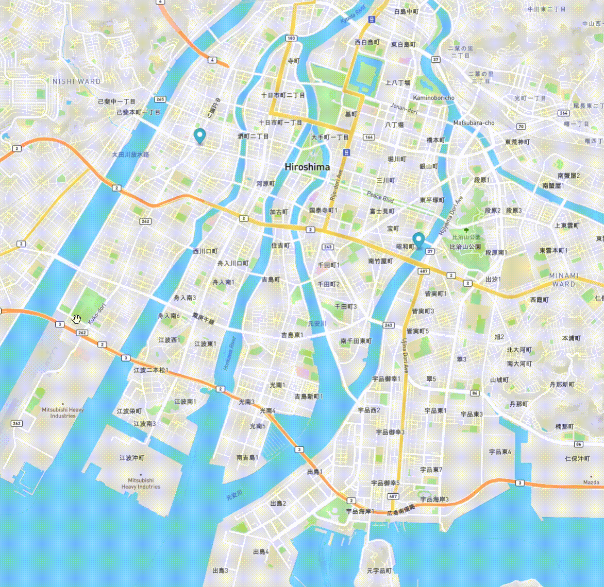

## 概要

RAPTORアルゴリズムによりバス停間の時刻を考慮した２地点間経路検索、到達圏検索を行うプログラムである。

## 実行環境

#### golangで直接動かす場合
- golang v1.15以上

#### Docker / docker-compose で動かす場合
- docker / docker-compose

## APIサーバ起動方法

1 . ``/GTFS``に展開したGTFSのテキストファイルを配置。

2 . 停留所間の距離を直線距離でなく道のりにする場合、OpenStreetMapの地図データを配置。

3 . 設定ファイルを作成し、``conf.json``というファイル名で配置

#### conf.json

```json
{
  "start_date":"20210215",
  "end_date":"20210215",
  "connect_range":100,
  "map":"chugoku-latest.osm.pbf",
  "num_threads":10
}
```

|変数名|設定内容|暫定値|単位|
|---|---|---|---|
|start_date|メモリ上に読み込む時刻表の開始日|指定必須|日付|
|end_date|メモリ上に読み込む時刻表の終了日|指定必須|日付|
|connect_range|接続する停留所間の最大距離|100|メートル|
|map.max_lat|道路網の利用する最大緯度|90|度|
|map.max_lon|道路網の利用する最大経度|180|度|
|map.min_lat|道路網の利用する最小緯度|-90|度|
|map.min_lon|道路網の利用する最小経度|-180|度|
|is_use_GTFS_transfer|GTFSのTransferにより停留所間を接続するか否か|false|真偽値|
|walking_speed|Transferを作る上での歩行速度|80|メートル毎分|
|num_threads|データ読み込み時に使用するスレッド数|1|個|

3 . サーバ起動

```
$ go run .\server.go
```

又は

```
$ docker-compose up -d
```


## GUIによる１対１地点間経路検索

[http://localhost:8000/](http://localhost:8000/) にアクセスし、適当な2点をクリックすると経路が検索される。



## 地点間経路検索

２地点間の経路を検索する。

```
http://localhost:8000/routing?json={"origin":{"lat":34.37692415452747,"lon":132.42414953813244,"time":28800},"destination":{"lat":34.38318747390964,"lon":132.46417910281428},"json_only":true,"properties":{"timetable":"20210215"}}
```

#### リクエストパラメータ
|変数名|設定内容|暫定値|単位|
|---|---|---|---|
|origin.lat|出発地点の緯度|条件付き必須|度|
|origin.lon|出発地点の経度|条件付き必須|度|
|origin.stop_id|出発地点のstop_id|条件付き必須||
|origin.time|0:00を基準とした出発時刻|必須|秒|
|destination.lat|目的地点の緯度|条件付き必須|
|destination.lon|目的地点の経度|条件付き必須|
|destination.stop_id|目的地点のstop_id|条件付き必須|
|LimitTime|経路探索する上での最大許容時刻|36000|秒|
|LimitTransfer|経路探索する上での最大許容乗車回数|5|回|
|WalkSpeed|歩行速度|80|メートル毎秒|
|Property.Timetable|経路探索する時刻表（日付）|必須|
<!-- |destination.time|0:00を基準とした到着時刻|必須|秒| -->


## 到達圏検索

１地点からの到達圏を検索する。
RAPTORアルゴリズムの特性上、２地点間検索と時間はあまり変わらない。

```
http://localhost:8000/routing_surface?json={"origin":{"time":28800,"lat":34.38291392395102,"lon":132.4260767353174},"destination":{"time":32400,"lat":34.39101899572567,"lon":132.45094923488853},"json_only":true,"properties":{"timetable":"20210215"}}
```

#### リクエストパラメータ
|変数名|設定内容|暫定値|単位|
|---|---|---|---|
|origin.lat|出発地点の緯度|条件付き必須|度|
|origin.lon|出発地点の経度|条件付き必須|度|
|origin.stop_id|出発地点のstop_id|条件付き必須||
|origin.time|0:00を基準とした出発時刻|必須|秒|
|LimitTime|経路探索する上での最大許容時刻|36000|秒|
|LimitTransfer|経路探索する上での最大許容乗車回数|5|回|
|WalkSpeed|歩行速度|80|メートル毎秒|
|Property.Timetable|経路探索する時刻表（日付）|必須|

のようにjsonに出発地と到着地の緯度経度を指定する。

表示されたGeoJSONを右クリックで保存し、[kepler.gl](https://kepler.gl/demo)にドラックアンドドロップすると可視化される。


<!-- ## Project layout

    mkdocs.yml    # The configuration file.
    docs/
        index.md  # The documentation homepage.
        ...       # Other markdown pages, images and other files. -->
