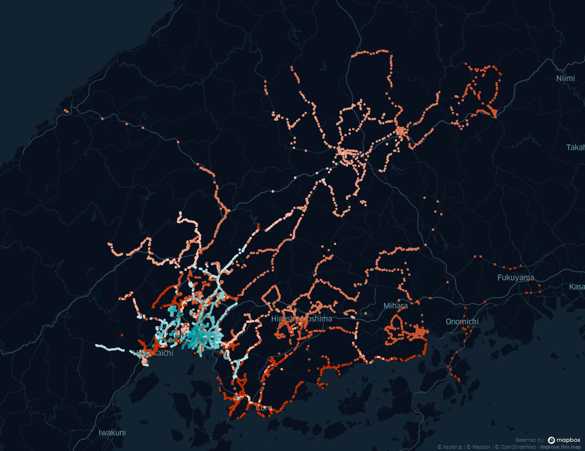

## 概要

RAPTORアルゴリズムによりバス停間の時刻を考慮した２地点間経路検索、到達圏検索を行うプログラムである。

## 実行環境

#### golangで直接動かす場合
- golang v1.15以上

#### Docker / docker-compose で動かす場合
- docker / docker-compose

## APIサーバ起動方法

1 . ``original_data``フォルダにGTFSを配置。

2 . 停留所間の距離を直線距離でなく道のりにする場合、``original_data``フォルダにOpenStreetMapの地図データを配置。

3 . 以下のような設定ファイルを作成し、``original_data``フォルダに``conf.json``というファイル名で配置

#### conf.json

```json
{
  "start_date":"20220215",
  "end_date":"20220215",
  "connect_range":500,
  "GTFS":{
    "path":"GTFS"
  },
  "map":{
    "file_name":"chugoku-latest.osm.pbf",
    "max_lat":180,
    "max_lon":180,
    "min_lat":0,
    "min_lon":0
  },
  "is_use_GTFS_transfer":true,
  "num_threads":10,
  "walking_speed":80
}
```

|変数名|設定内容|暫定値|単位|
|---|---|---|---|
|start_date|メモリ上に読み込む時刻表の開始日|指定必須|日付|
|end_date|メモリ上に読み込む時刻表の終了日|指定必須|日付|
|connect_range|接続する停留所間の最大距離|100|メートル|
|GTFS.path|展開したGTFSが配置されているディレクトリ（.zipで終わる場合は展開されてないGTFSとして認識し、自動で展開される）|なし|文字列|
|map.file_name|Open Street Mapのファイル名|なし|文字列|
|map.max_lat|道路網の利用する最大緯度|90|度|
|map.max_lon|道路網の利用する最大経度|180|度|
|map.min_lat|道路網の利用する最小緯度|-90|度|
|map.min_lon|道路網の利用する最小経度|-180|度|
|is_use_GTFS_transfer|GTFSのTransferにより停留所間を接続するか否か|false|真偽値|
|walking_speed|Transferを作る上での歩行速度|80|メートル毎分|
|num_threads|データ読み込み時に使用するスレッド数|1|個|

4 . 停留所間の接続情報作成

以下のコマンドを実行することで、Open Street Mapに基づいた道のりによる停留所間の接続を作成する。
作成された停留所間の接続情報は、GTFS内の``transfer.txt``に保存される。既に存在する場合は上書きされるため注意。
なお、``is_use_GTFS_transfer``が``false``の場合、停留所の緯度経度を基に次に記述するサーバープログラムが接続情報を作成するため、この手順は不要となるが、計算時間の観点から予め接続情報を作ることを推奨する。

```
$ go run addTransfer.go
```

5 . サーバ起動

APIサーバーを起動する。

```
$ go run .\server.go
```

又は

```
$ docker-compose up -d
```


## GUIによる１対１地点間経路検索

[http://localhost:8000/](http://localhost:8000/) にアクセスし、適当な2点をクリックすると経路が検索される。


## 地点間経路検索

２地点間の経路を検索する。

```
http://localhost:8000/routing?json={"origin":{"lat":34.37692415452747,"lon":132.42414953813244,"time":28800},"destination":{"lat":34.38318747390964,"lon":132.46417910281428},"json_only":true,"properties":{"timetable":"20210215"}}
```

#### リクエストパラメータ
|変数名|設定内容|暫定値|単位|
|---|---|---|---|
|origin.lat|出発地点の緯度|条件付き必須|度|
|origin.lon|出発地点の経度|条件付き必須|度|
|origin.stop_id|出発地点のstop_id|条件付き必須||
|origin.time|0:00を基準とした出発時刻|必須|秒|
|destination.lat|目的地点の緯度|条件付き必須|
|destination.lon|目的地点の経度|条件付き必須|
|destination.stop_id|目的地点のstop_id|条件付き必須|
|limit.time|経路探索する上での最大許容時刻|36000|秒|
|limit.transfer|経路探索する上での最大許容乗車回数|5|回|
|property.walk_speed|歩行速度|80|メートル毎秒|
|property.timetable|経路探索する時刻表（日付）|必須|
<!-- |destination.time|0:00を基準とした到着時刻|必須|秒| -->


## 到達圏検索

１地点からの到達圏を検索する。
RAPTORアルゴリズムの特性上、２地点間検索と時間はあまり変わらない。

```
http://localhost:8000/routing_surface?json={"origin":{"time":28800,"lat":34.38291392395102,"lon":132.4260767353174},"destination":{"time":32400,"lat":34.39101899572567,"lon":132.45094923488853},"json_only":true,"properties":{"timetable":"20210215"}}
```

#### リクエストパラメータ
|変数名|設定内容|暫定値|単位|
|---|---|---|---|
|origin.lat|出発地点の緯度|条件付き必須|度|
|origin.lon|出発地点の経度|条件付き必須|度|
|origin.stop_id|出発地点のstop_id|条件付き必須||
|origin.time|0:00を基準とした出発時刻|必須|秒|
|LimitTime|経路探索する上での最大許容時刻|36000|秒|
|LimitTransfer|経路探索する上での最大許容乗車回数|5|回|
|WalkSpeed|歩行速度|80|メートル毎秒|
|Property.Timetable|経路探索する時刻表（日付）|必須|

のようにjsonに出発地と到着地の緯度経度を指定する。

表示されたGeoJSONを右クリックで保存し、[kepler.gl](https://kepler.gl/demo)にドラックアンドドロップすると可視化される。




### レスポンス

```
[]trips                 # 旅程
  []legs                # １乗車
    type                # Leg種類 (wait, walk, bus)
    vechicle            # 乗り物情報
      trip_id           # GTFSに準じる
      trip_description  # GTFSに準じる
      route_long_name   # GTFSに準じる
      service_id        # GTFSに準じる
      trip_type         # GTFSに準じる
      route_color       # GTFSに準じる
      route_text_color  # GTFSに準じる
      route_short_name  # GTFSに準じる
      trip_headsign     # GTFSに準じる
      route_id          # GTFSに準じる  
    []stop_times        # GTFSに準じる
      stop_id           # GTFSに準じる
      zone_id           # GTFSに準じる
      stop_lat          # GTFSに準じる
      stop_lon          # GTFSに準じる
      stop_name         # GTFSに準じる
      arrival_time      # GTFSに準じる
      departure_time    # GTFSに準じる
      pickup_type       # GTFSに準じる
      drop_off_type     # GTFSに準じる
      stop_sequence     # GTFSに準じる
    []time_edges        # 混雑集約などに用いる時空間グラフにおける辺
    geometry            # 地理情報
      type              # GeoJSONに準じる
      []coordinates     # GeoJSONに準じる
    cost                # Legのコスト
      time              # 所要時間
      walk              # 歩行距離
      transfer          # 乗車回数
      distance          # 距離
      fare              # 運賃
    properties          # プロパティ
      arrival_time      # 到着時刻
      departure_time    # 出発時刻
  cost                  # Tripのコスト
    time                # 所要時間
    walk                # 歩行距離
    transfer            # 乗車回数
    distance            # 移動距離
    fare                # 運賃
  properties            # プロパティ
    arrival_time        # 到着時刻
    departure_time      # 出発時刻
```
